# The Web Developer Bootcamp
A repository for uDemy course on web development

## Covered topics:

### Front-end
- HTML5
- CSS3
- Bootstrap 4
- Semantic UI
- JavaScript
- jQuery
- DOM Manipulation

### Back-end:
- HTTP
- NodeJS
- NPM
- ExpressJS
- REST
- API
- JSON
- MongoDB
- Mongoose
- Authentication
- Authorization
- PassportJS

### Other:
- GoormIDE
- Heroku
- Git
- Unix

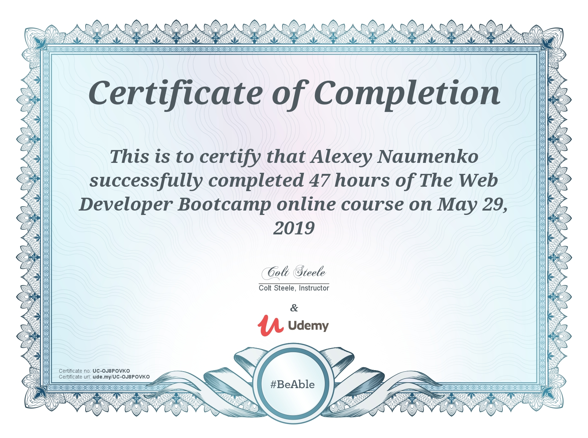

# Projects created during the course:
## Responsive Websites (HTML and CSS)

### - Project_1
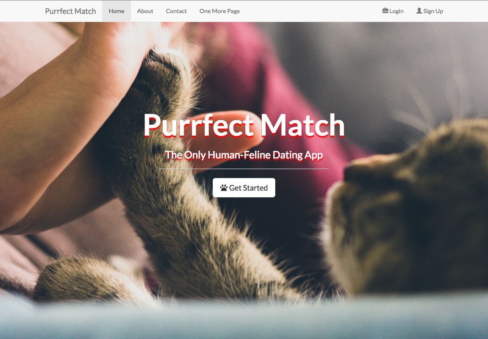
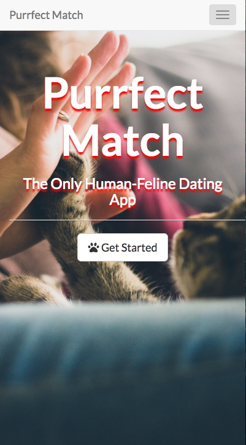
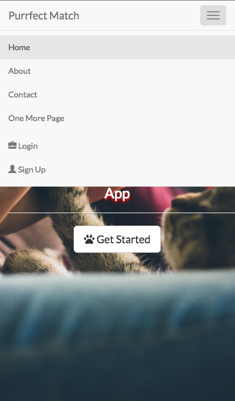

### - Project_2
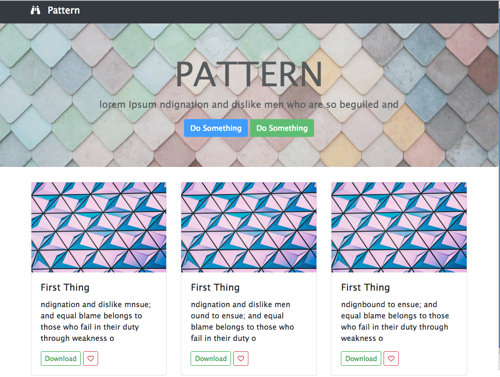

## To do App (HTML, CSS, JavaScript, jQuery)
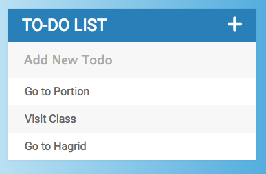

## Browser-based-game (HTML, CSS, JavaScript)
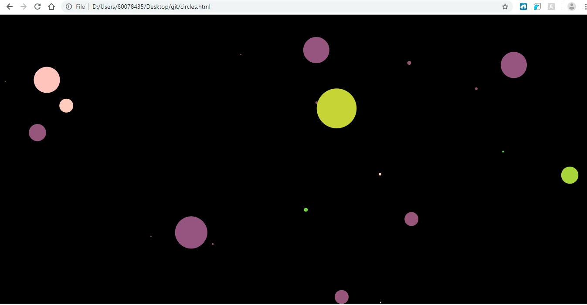

## Movie Search App via IMDB API

## RESTful Blog (NodeJS, ExpressJS, JavaScript)
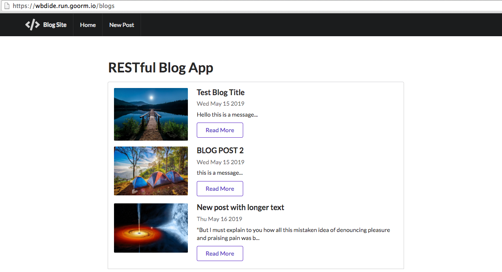
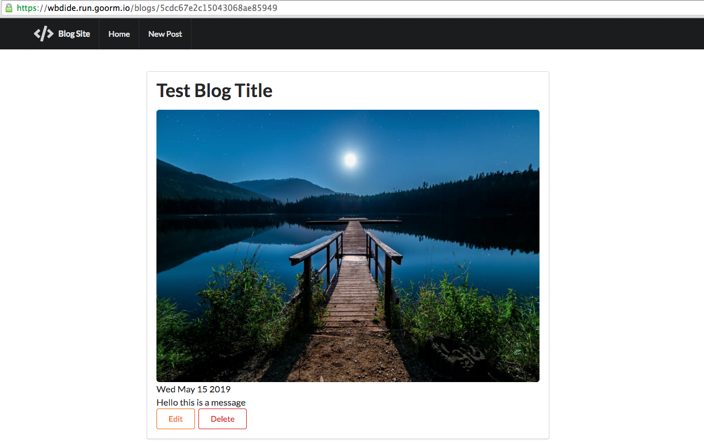

## Final project - web app with authorization/authentication
### Use the link to see it: https://thawing-eyrie-82394.herokuapp.com/
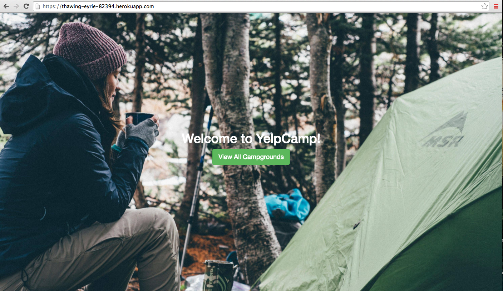
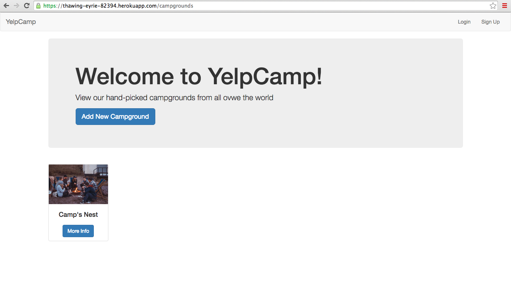
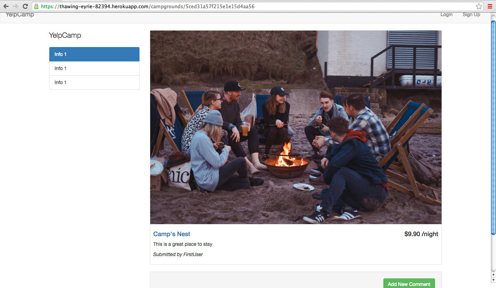

